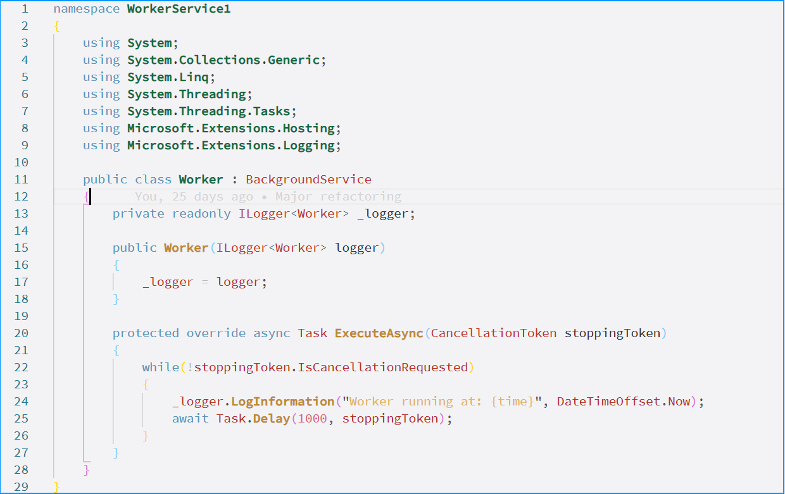
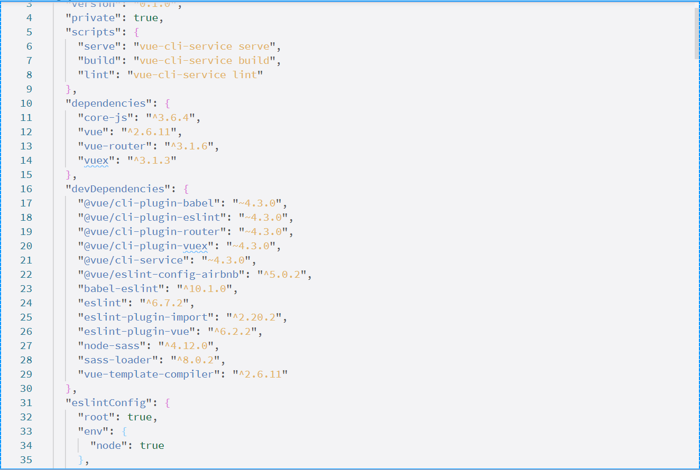
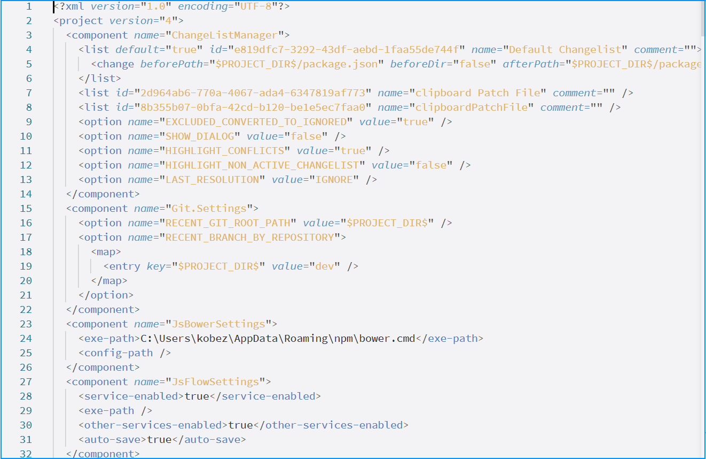

# Blue Dream Light Theme
### A tasteful use of blue that gives an excuse to come back to the light side.   

**Description** 

Code colors are a tastful mix providing contrast to easily dicern different language elements.  

*A big thanks to all those who inspired this theme. I just wish I remember who they were!*  

**Screenshots** 

Various file types are provided to give a good overview of what you have in store while you 
while saving the world... one line of code at a time!

### For more information
* [Blue Dream Project](http://www.github.com/CJPrindle/Blue-Dream)

**Enjoy!**
